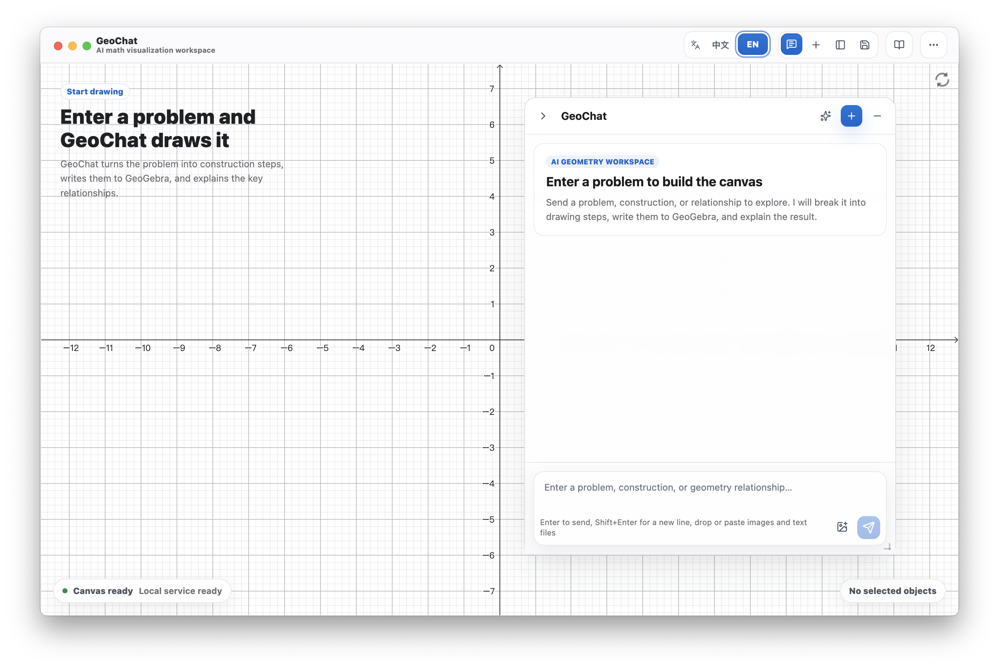

<p align="center">
  
</p>

<h1 align="center">GeoChat Desktop</h1>

<p align="center">
  A local-first AI mathematics visualization workspace. Enter a problem, and
  GeoChat constructs, draws, and explains it.
</p>

<p align="center">
  <a href="README.md">中文</a>
  ·
  <a href="#preview">Preview</a>
  ·
  <a href="#quick-start">Quick Start</a>
  ·
  <a href="#features">Features</a>
  ·
  <a href="#star-history">Star History</a>
</p>

<p align="center">
  <a href="LICENSE"></a>
  <a href="https://github.com/tiwe0/GeoChat/stargazers"></a>
  
  
  
</p>

## Preview

### Screenshots



### Videos

#### Demo video 1

<video src="https://raw.githubusercontent.com/tiwe0/GeoChat/master/docs/media/geochat-desktop-demo-1080p.mp4" controls width="100%"></video>

[Open the video file if playback is unavailable](docs/media/geochat-desktop-demo-1080p.mp4)

#### Demo video 2

<video src="https://raw.githubusercontent.com/tiwe0/GeoChat/master/docs/media/geochat-desktop-demo-en.mp4" controls width="100%"></video>

[Open the video file if playback is unavailable](docs/media/geochat-desktop-demo-en.mp4)

## Introduction

GeoChat Desktop is a local-first AI mathematics workbench built around an
embedded GeoGebra canvas. It combines a Tauri 2 desktop shell, a SolidJS
renderer, a local Bun backend sidecar, SQLite persistence, and shared agent
contracts in `@geochat-ai/app`.

This repository is designed for a desktop build that runs locally. You can use
bring-your-own-key model providers for the local workspace, and the core desktop
workflow does not require online checks.

## Features

| Capability | What it does |
| --- | --- |
| Math canvas | Local 2D/3D mathematics visualization canvas for construction, verification, and explanation. |
| AI drawing workflow | Turns a problem into construction steps, writes them to the canvas, and explains the key relationships. |
| Bring your own key | Configure model provider API keys on your own device; core desktop workflows do not require online checks. |
| Local persistence | Stores conversations, blackboards, and agent-run records in SQLite. |
| Problem-bank tooling | Includes local problem-bank data models, import tools, and regression tests. |
| Desktop debugging | Includes desktop debug MCP tools for local inspection and smoke testing. |
| Tauri packaging | Ships a desktop shell with a Bun runtime sidecar and replaceable app-bundle resources. |

## Repository Contents

```text
backend/          Local Bun backend, HTTP routes, SQLite repositories, services.
packages/app/     Shared schemas, agent contracts, policies, and GeoGebra helpers.
src/renderer/     SolidJS desktop workbench UI.
src/shared/       Shared renderer/backend TypeScript helpers.
src-tauri/        Tauri shell, Rust command bridge, packaging, sidecar control.
tests/            Contract and regression tests.
tools/            Local data import, smoke, and desktop-debug tooling.
vendor/geogebra/  Vendored GeoGebra runtime assets used by the desktop app.
docs/             Architecture, product, and development notes.
scripts/          Local build, bundle, and verification scripts.
```

## Prerequisites

- Bun `1.3.11` or compatible.
- Rust stable toolchain.
- Platform build tools required by Tauri 2.
  - macOS: Xcode Command Line Tools.
  - Windows: Microsoft C++ Build Tools and WebView2 runtime.
  - Linux: the WebKitGTK and native build packages required by Tauri.

The project uses Bun as the package manager and runtime for the local backend.

## Quick Start

```sh
bun install
bun run dev
```

`bun run dev` starts the Tauri shell. During development, the shell starts the
local Bun backend automatically unless `GEOCHAT_DESKTOP_BACKEND_URL` points at
an existing backend.

The default SQLite database path is:

```text
./data/geochat-desktop.sqlite
```

Override it when needed:

```sh
GEOCHAT_DESKTOP_DB_PATH=./data/dev.sqlite bun run dev
```

## Model Configuration

Open the app settings and configure a model provider key. Keys are stored in the
desktop configuration on the current device.

The shared model registry supports the providers present in the app package and
normalizes custom provider/model settings through the local configuration UI.

## Common Commands

```sh
bun run dev                 # Start the Tauri desktop app in development mode.
bun run backend:dev         # Start only the local backend.
bun run typecheck           # Type-check shared, Node, and renderer TypeScript.
bun test tests              # Run the Bun test suite.
bun run tauri:check         # Run cargo check for the Tauri shell.
bun run tauri:prepare       # Build backend, renderer, vendor, runtime, manifest.
bun run build               # Type-check and prepare the app bundle.
bun run dist                # Build a local Tauri app package.
```

For desktop MCP batch testing, use the same local token in both processes:

```sh
GEOCHAT_DESKTOP_LOCAL_AUTH_TOKEN=dev-batch-token bun run dev
GEOCHAT_DESKTOP_LOCAL_AUTH_TOKEN=dev-batch-token bun tools/run-desktop-problem-batch.ts
```

## App-Bundle Boundary

The packaged desktop app is a Tauri shell around app-bundle resources. The shell
owns native commands, window lifecycle, the fixed Bun runtime sidecar, and
packaging. The app bundle owns compiled backend code, compiled renderer files,
and vendored resources.

`bun run tauri:prepare` produces:

```text
dist/backend/backend.bundle.js
dist/renderer/index.html
dist/vendor/**
dist/runtime/bun
dist/app-bundle-manifest.json
```

The app-bundle manifest lists only `backend`, `renderer`, and `vendor` assets.
It must not include `dist/runtime`; Bun is the fixed runtime sidecar.

Useful local gates:

```sh
bun run tauri:prepare
bun run bundle:smoke
bun run package:backend-smoke
```

## Development Notes

- GeoGebra runtime assets are served locally from `vendor/geogebra`.
- The local backend serves desktop health, assets, conversations, problem-bank
  records, provider proxying, and agent-run routes.
- Provider API keys should be supplied by users at runtime. Do not commit local
  credentials, `.env`, `.dev.vars`, SQLite databases, or generated build output.
- See `docs/open-source-boundary.md` for the public repository boundary.
- See `docs/geogebra-applet.md` for GeoGebra integration notes.
- See `docs/agent-harness-roadmap.md` for the agent runner architecture.
- See `docs/tauri2-shell-migration-plan.md` for Tauri shell notes.

## Verification Before Publishing

Run the public checks before pushing a release branch or public mirror:

```sh
bun run oss:check
bun run typecheck
bun run tauri:prepare
bun run tauri:check
bun test tests
```

Run an external history secret scanner before publishing a new public remote.
Local pattern scans are useful, but they are not a substitute for a full history
scanner.

## Copyright and Author

- Copyright (c) 2026 Ivory.
- Author: Ivory <contact@ivory.cafe>
- GeoChat-owned source code and documentation are licensed under the Apache
  License, Version 2.0. See `LICENSE` and `NOTICE`.
- This repository also includes third-party components under their own license
  terms. In particular, `vendor/geogebra/` is not relicensed as GeoChat-owned
  Apache-2.0 code. See `THIRD_PARTY_NOTICES.md` and the GeoGebra license terms
  before redistributing builds that include the vendored GeoGebra runtime.

## Contributing

Keep changes focused and verifiable:

- Prefer existing project patterns over new abstractions.
- Add or update tests for behavior changes.
- Run the relevant checks listed above.
- Do not commit credentials, local databases, or generated build artifacts.

Security-sensitive reports should avoid including live credentials in issue
text, logs, screenshots, or reproduction data.

## Star History

If GeoChat is useful to you, a Star helps us understand which directions are
worth continuing to invest in.

[](https://www.star-history.com/?type=date&repos=tiwe0%2FGeoChat)
