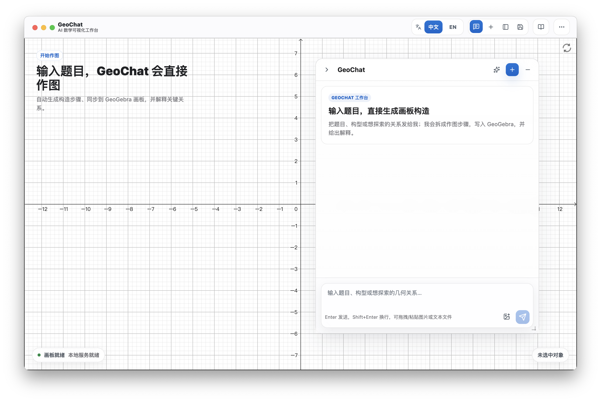

# GeoChat Desktop

[English](README.en.md)

## 预览

### 截图

<p>
  
  
</p>

### 视频

- [1080p 桌面演示](docs/media/geochat-desktop-demo-1080p.mp4)
- [英文界面演示](docs/media/geochat-desktop-demo-en.mp4)

<video src="docs/media/geochat-desktop-demo-1080p.mp4" controls width="100%"></video>

<video src="docs/media/geochat-desktop-demo-en.mp4" controls width="100%"></video>

## 项目介绍

GeoChat Desktop 是一个本地优先的 AI 数学可视化工作台，核心是内嵌的
GeoGebra 画板。它把 Tauri 2 桌面外壳、SolidJS 渲染层、本地 Bun 后端
sidecar、SQLite 持久化，以及 `@geochat-ai/app` 中的共享 Agent 协议组合在
一起。

这个仓库面向可本地运行的桌面版本。你可以使用自己的模型供应商密钥运行本地
工作区，不需要在线校验才能使用核心桌面功能。

## 功能

- 基于 GeoGebra 的本地 2D/3D 数学画板。
- 输入题目后生成构造步骤、写入 GeoGebra，并解释关键关系。
- 支持自带模型供应商密钥。
- 使用 SQLite 保存本地对话、黑板和 Agent 运行记录。
- 包含本地题库数据模型和导入工具。
- 包含桌面调试 MCP 工具，便于本地检查和 smoke testing。
- Tauri 桌面外壳集成 Bun runtime sidecar 和可替换 app-bundle 资源。

## 仓库内容

```text
backend/          本地 Bun 后端、HTTP 路由、SQLite 仓库和服务。
packages/app/     共享 schema、Agent 协议、策略和 GeoGebra 辅助逻辑。
src/renderer/     SolidJS 桌面工作台 UI。
src/shared/       渲染层和后端共享的 TypeScript 工具。
src-tauri/        Tauri 外壳、Rust 命令桥、打包和 sidecar 控制。
tests/            合同测试和回归测试。
tools/            本地数据导入、smoke 和桌面调试工具。
vendor/geogebra/  桌面应用使用的 GeoGebra runtime 资源。
docs/             架构、产品和开发说明。
scripts/          本地构建、bundle 和验证脚本。
```

## 环境要求

- Bun `1.3.11` 或兼容版本。
- Rust stable toolchain。
- Tauri 2 所需的平台构建工具。
  - macOS: Xcode Command Line Tools。
  - Windows: Microsoft C++ Build Tools 和 WebView2 runtime。
  - Linux: Tauri 所需的 WebKitGTK 和原生构建包。

本项目使用 Bun 作为包管理器，并用 Bun 运行本地后端。

## 快速开始

```sh
bun install
bun run dev
```

`bun run dev` 会启动 Tauri 桌面应用。开发模式下，除非
`GEOCHAT_DESKTOP_BACKEND_URL` 指向已有后端，否则桌面外壳会自动启动本地
Bun 后端。

默认 SQLite 数据库路径：

```text
./data/geochat-desktop.sqlite
```

需要时可以覆盖：

```sh
GEOCHAT_DESKTOP_DB_PATH=./data/dev.sqlite bun run dev
```

## 模型配置

打开应用设置，配置你的模型供应商密钥。密钥会保存在当前设备的桌面配置中。

共享模型注册表支持应用包中已有的供应商，并通过本地配置 UI 规范化自定义
供应商和模型设置。

## 常用命令

```sh
bun run dev                 # 启动 Tauri 桌面开发应用。
bun run backend:dev         # 只启动本地后端。
bun run typecheck           # 检查共享、Node 和渲染层 TypeScript。
bun test tests              # 运行 Bun 测试套件。
bun run tauri:check         # 对 Tauri 外壳运行 cargo check。
bun run tauri:prepare       # 构建后端、渲染层、vendor、runtime 和 manifest。
bun run build               # 类型检查并准备 app bundle。
bun run dist                # 构建本地 Tauri 应用包。
```

桌面 MCP 批量测试需要两个进程使用同一个本地 token：

```sh
GEOCHAT_DESKTOP_LOCAL_AUTH_TOKEN=dev-batch-token bun run dev
GEOCHAT_DESKTOP_LOCAL_AUTH_TOKEN=dev-batch-token bun tools/run-desktop-problem-batch.ts
```

## App Bundle 边界

打包后的桌面应用是围绕 app-bundle 资源运行的 Tauri 外壳。外壳负责原生命令、
窗口生命周期、固定 Bun runtime sidecar 和打包流程。app bundle 负责已编译
的后端代码、已编译的渲染层文件和 vendor 资源。

`bun run tauri:prepare` 会生成：

```text
dist/backend/backend.bundle.js
dist/renderer/index.html
dist/vendor/**
dist/runtime/bun
dist/app-bundle-manifest.json
```

app-bundle manifest 只列出 `backend`、`renderer` 和 `vendor` 资源，不应包含
`dist/runtime`；Bun 是固定的 runtime sidecar。

常用本地检查：

```sh
bun run tauri:prepare
bun run bundle:smoke
bun run package:backend-smoke
```

## 开发说明

- GeoGebra runtime 资源从 `vendor/geogebra` 本地提供。
- 本地后端提供桌面健康检查、资源、对话、题库、供应商代理和 Agent 运行路由。
- 用户应在运行时提供模型 API key。不要提交本地凭据、`.env`、`.dev.vars`、
  SQLite 数据库或生成产物。
- 公开仓库边界见 `docs/open-source-boundary.md`。
- GeoGebra 集成说明见 `docs/geogebra-applet.md`。
- Agent runner 架构见 `docs/agent-harness-roadmap.md`。
- Tauri 外壳说明见 `docs/tauri2-shell-migration-plan.md`。

## 发布前验证

推送发布分支或公开镜像前运行：

```sh
bun run oss:check
bun run typecheck
bun run tauri:prepare
bun run tauri:check
bun test tests
```

发布到新的公开远程仓库前，建议再运行一次外部历史敏感信息扫描。普通本地模式
扫描有帮助，但不能替代完整历史扫描。

## 版权和作者

- Copyright (c) 2026 Ivory.
- Author: Ivory <contact@ivory.cafe>
- GeoChat 自有源代码和文档使用 Apache License, Version 2.0。见
  `LICENSE` 和 `NOTICE`。
- 本仓库也包含使用各自许可证的第三方组件。尤其是 `vendor/geogebra/` 不会被
  重新授权为 GeoChat 自有的 Apache-2.0 代码。重新分发包含 GeoGebra runtime
  的构建前，请阅读 `THIRD_PARTY_NOTICES.md` 和 GeoGebra 许可证条款。

## 贡献

保持改动聚焦且可验证：

- 优先沿用现有项目模式。
- 行为变化需要新增或更新测试。
- 运行上面列出的相关检查。
- 不要提交凭据、本地数据库或生成产物。

安全相关报告不要在 issue 文本、日志、截图或复现数据中包含真实凭据。

## Star History

[](https://www.star-history.com/?type=date&repos=tiwe0%2FGeoChat)
