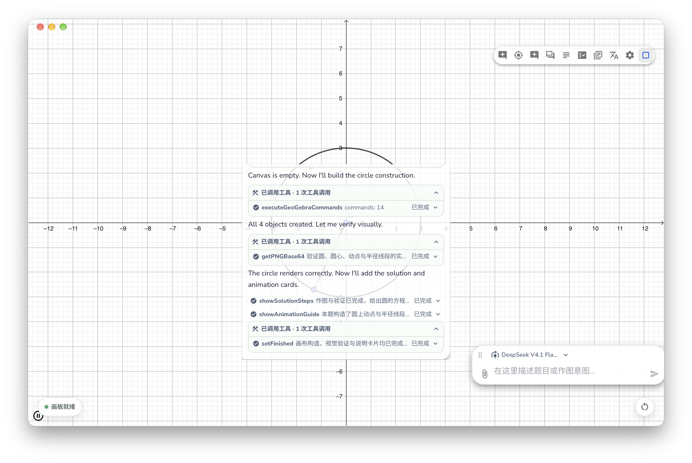
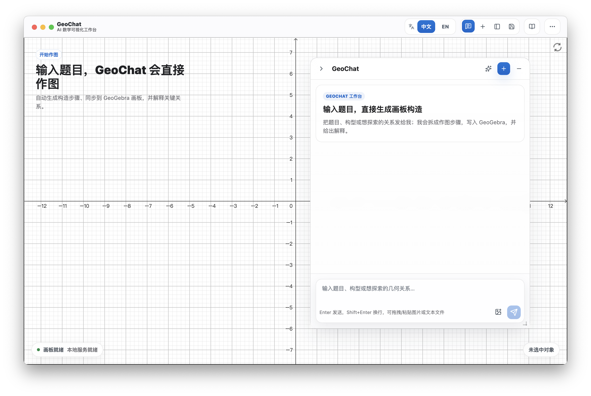

<p align="center">
  
</p>

<h1 align="center">GeoChat Desktop</h1>

<p align="center">
  让 AI 对话真正融入 GeoGebra 画板。随处唤起、就地作图、空间化讲解。
</p>

<p align="center">
  <a href="README.en.md">English</a>
  ·
  <a href="https://chat-with-geogebra.com">官网</a>
  ·
  <a href="https://github.com/tiwe0/GeoChat/releases/latest">下载</a>
  ·
  <a href="#预览">预览</a>
  ·
  <a href="#快速开始">快速开始</a>
  ·
  <a href="#功能">功能</a>
  ·
  <a href="#star-history">Star History</a>
</p>

<p align="center">
  <a href="LICENSE"></a>
  <a href="https://github.com/tiwe0/GeoChat/stargazers"></a>
  
  
  
</p>

下一版本：`v0.6.0` · 默认启用融合模式 · 官网：<https://chat-with-geogebra.com>

## 预览

### 融合模式



输入框不再被固定在单独窗口中。你可以在画板任意位置唤起它，回答会围绕本轮
作图位置展开；更早的消息会逐渐淡出，完整记录仍可随时从顶栏打开。

### 窗口模式



### 视频

#### 演示视频 1

<video src="https://raw.githubusercontent.com/tiwe0/GeoChat/master/docs/media/geochat-desktop-demo-1080p.mp4" controls width="100%"></video>

[无法播放时打开视频文件](docs/media/geochat-desktop-demo-1080p.mp4)

#### 演示视频 2

<video src="https://raw.githubusercontent.com/tiwe0/GeoChat/master/docs/media/geochat-desktop-demo-en.mp4" controls width="100%"></video>

[无法播放时打开视频文件](docs/media/geochat-desktop-demo-en.mp4)

## 项目介绍

GeoChat Desktop 是一个画板优先、本地优先的 AI 数学可视化工作台。v0.6.0
默认使用**融合模式**：输入框、思考过程、工具调用和回答不再占据固定聊天窗口，
而是直接出现在相关的 GeoGebra 构造附近。传统窗口模式仍然保留，并可随时无损
切换。

应用把 Tauri 2 桌面外壳、React 渲染层、本地 Bun 后端 sidecar、SQLite
持久化，以及 `@geochat-ai/app` 中的共享 Agent 协议组合在一起。

这个仓库面向可本地运行的桌面版本。你可以使用自己的模型供应商密钥运行本地
工作区，不需要在线校验才能使用核心桌面功能。

## 功能

| 能力 | 说明 |
| --- | --- |
| 默认融合模式 | 在画板任意位置唤起输入框，让每轮回答与对应构造保持空间关联。 |
| 空间化对话 | 流式回答、思考和工具调用以轻量气泡展示；旧消息自动淡出，避免遮挡画板。 |
| 双模式切换 | 融合模式与窗口模式通过圆形扩散动画切换，并保留当前会话、运行状态和业务面板。 |
| 画板上下文 | 发送时读取当前选中的 GeoGebra 对象，让追问指向具体图形。 |
| 数学画板 | 本地 2D/3D 数学可视化画布，适合构造、验证和讲解几何关系。 |
| AI 作图流程 | 输入题目后生成构造步骤、写入画板，并解释关键关系。 |
| 自带模型密钥 | 用户在本机配置模型供应商 API key，不需要在线校验才能使用核心桌面功能。 |
| 本地持久化 | 使用 SQLite 保存本地对话、黑板和 Agent 运行记录。 |
| 题库工具 | 包含本地题库数据模型、导入工具和回归测试。 |
| 桌面调试 | 内置桌面调试 MCP 工具，便于本地检查和 smoke testing。 |
| Tauri 打包 | 桌面外壳集成 Bun runtime sidecar 和可替换 app-bundle 资源。 |

## 仓库内容

```text
backend/          本地 Bun 后端、HTTP 路由、SQLite 仓库和服务。
packages/app/     共享 schema、Agent 协议、策略和 GeoGebra 辅助逻辑。
src/renderer-react/ React 桌面工作台 UI。
src/shared/       渲染层和后端共享的 TypeScript 工具。
src-tauri/        Tauri 外壳、Rust 命令桥、打包和 sidecar 控制。
tests/            合同测试和回归测试。
tools/            本地数据导入、smoke 和桌面调试工具。
vendor/geogebra/  桌面应用使用的 GeoGebra runtime 资源。
docs/             架构、产品和开发说明。
scripts/          本地构建、bundle 和验证脚本。
```

## 环境要求

- Bun `1.3.11` 或兼容版本。
- Rust stable toolchain。
- Tauri 2 所需的平台构建工具。
  - macOS: Xcode Command Line Tools。
  - Windows: Microsoft C++ Build Tools 和 WebView2 runtime。
  - Linux: Tauri 所需的 WebKitGTK 和原生构建包。

本项目使用 Bun 作为包管理器，并用 Bun 运行本地后端。

## 快速开始

```sh
bun install
bun run dev
```

`bun run dev` 会启动 Tauri 桌面应用。开发模式下，除非
`GEOCHAT_DESKTOP_BACKEND_URL` 指向已有后端，否则桌面外壳会自动启动本地
Bun 后端。

默认 SQLite 数据库路径：

```text
./data/geochat-desktop.sqlite
```

需要时可以覆盖：

```sh
GEOCHAT_DESKTOP_DB_PATH=./data/dev.sqlite bun run dev
```

## 模型配置

打开应用设置，只配置并保存各模型供应商的 API key。密钥会保存在当前设备的桌面配置中。

在对话页面选择供应商和具体模型；配置页不负责选择模型。共享模型注册表会根据
已保存的供应商 key 提供可用选项。

## 融合模式

融合模式是 v0.6.0 的默认交互方式：

- 按 `⌘K`（macOS）或 `Ctrl+K`（Windows/Linux）在最近使用的位置唤起输入框。
- 使用顶栏的定位按钮，再点击画板，可把下一轮对话放在指定位置。
- 输入框可以直接拖动；提交后，本轮消息会固定在对应锚点附近。
- 可收起、固定、关闭或在原位置继续某一轮回答；失败的轮次可就地重试。
- 顶栏仍可打开完整对话、历史记录、黑板、题库和设置。
- 模式切换不会丢失当前对话、模型运行状态或已打开的业务面板。

如果更偏好传统布局，可通过右上角模式按钮或设置中的“交互模式”切换回窗口模式。

## 常用命令

```sh
bun run dev                 # 启动 Tauri 桌面开发应用。
bun run backend:dev         # 只启动本地后端。
bun run typecheck           # 检查共享、Node 和渲染层 TypeScript。
bun test tests              # 运行 Bun 测试套件。
bun run tauri:check         # 对 Tauri 外壳运行 cargo check。
bun run tauri:prepare       # 构建后端、渲染层、vendor、runtime 和 manifest。
bun run build               # 类型检查并准备 app bundle。
bun run dist                # 构建本地 Tauri 应用包。
```

桌面 MCP 批量测试需要两个进程使用同一个本地 token：

```sh
GEOCHAT_DESKTOP_LOCAL_AUTH_TOKEN=dev-batch-token bun run dev
GEOCHAT_DESKTOP_LOCAL_AUTH_TOKEN=dev-batch-token bun tools/run-desktop-problem-batch.ts
```

## App Bundle 边界

打包后的桌面应用是围绕 app-bundle 资源运行的 Tauri 外壳。外壳负责原生命令、
窗口生命周期、固定 Bun runtime sidecar 和打包流程。app bundle 负责已编译
的后端代码、已编译的渲染层文件和 vendor 资源。

`bun run tauri:prepare` 会生成：

```text
dist/backend/backend.bundle.js
dist/renderer/index.html
dist/vendor/**
dist/runtime/bun
dist/app-bundle-manifest.json
```

app-bundle manifest 只列出 `backend`、`renderer` 和 `vendor` 资源，不应包含
`dist/runtime`；Bun 是固定的 runtime sidecar。

常用本地检查：

```sh
bun run tauri:prepare
bun run bundle:smoke
bun run package:backend-smoke
```

## 开发说明

- GeoGebra runtime 资源从 `vendor/geogebra` 本地提供。
- 本地后端提供桌面健康检查、资源、对话、题库、供应商代理和 Agent 运行路由。
- 用户应在运行时提供模型 API key。不要提交本地凭据、`.env`、`.dev.vars`、
  SQLite 数据库或生成产物。
- GeoGebra 集成说明见 `docs/geogebra-applet.md`。
- AI SDK 原生 Agent 架构见 `docs/ai-sdk-native-migration.md`。
- Tauri 外壳说明见 `docs/tauri2-shell-migration-plan.md`。

## 发布前验证

推送发布分支或公开镜像前运行：

```sh
bun run typecheck
bun run tauri:prepare
bun run tauri:check
bun test tests
```

### 发布桌面版

使用根目录的发布脚本统一更新 `package.json`、`src-tauri/Cargo.toml`、
`src-tauri/Cargo.lock`、`src-tauri/tauri.conf.json` 和官网的 fallback 版本。默认只修改本地文件并执行检查，
不会创建提交、tag 或推送远程：

```sh
bun run release -- --version 0.5.1
```

确认版本和检查结果后，可以分步提交和打 tag：

```sh
bun run release -- --version 0.5.1 --commit --tag
git push origin master
git push origin v0.5.1
```

也可以在确认工作区干净且当前分支为 `master` 后一次完成推送：

```sh
bun run release -- --version 0.5.1 --commit --tag --push
```

`--push` 会触发 `.github/workflows/tauri-package.yml`：它先运行验证，随后构建
Windows/macOS 安装包、创建 GitHub Release，并在配置了 R2 时上传安装包和
`latest.json`；同一个发布提交还会触发 `website.yml` 构建并部署 Cloudflare Pages。
脚本会等待并检查 Actions、Release、R2 manifest、Pages 部署，以及官网首页和
下载页的版本同步。使用 `--no-watch` 可跳过远程等待，`--dry-run` 可预览动作，
`--skip-checks` 仅适用于明确知道风险的本地调试场景。R2 和官网检查分别使用
`GEOCHAT_DOWNLOADS_BASE_URL`、`GEOCHAT_SITE_URL` 环境变量。

v0.6.0 发布流程将验证 Windows/macOS 安装包、GitHub Release、Cloudflare R2
镜像和 Cloudflare Pages 部署链路。官网域名为 `chat-with-geogebra.com`。

发布到新的公开远程仓库前，建议再运行一次外部历史敏感信息扫描。普通本地模式
扫描有帮助，但不能替代完整历史扫描。

## 版权和作者

- Copyright (c) 2026 Ivory.
- Author: Ivory <contact@ivory.cafe>
- GeoChat 自有源代码和文档使用 Apache License, Version 2.0。见
  `LICENSE` 和 `NOTICE`。
- 本仓库也包含使用各自许可证的第三方组件。尤其是 `vendor/geogebra/` 不会被
  重新授权为 GeoChat 自有的 Apache-2.0 代码。重新分发包含 GeoGebra runtime
  的构建前，请阅读 `THIRD_PARTY_NOTICES.md` 和 GeoGebra 许可证条款。

## 贡献

保持改动聚焦且可验证：

- 优先沿用现有项目模式。
- 行为变化需要新增或更新测试。
- 运行上面列出的相关检查。
- 不要提交凭据、本地数据库或生成产物。

安全相关报告不要在 issue 文本、日志、截图或复现数据中包含真实凭据。

## Star History

如果这个项目对你有帮助，欢迎给一个 Star。它能帮助我们判断哪些方向值得继续投入。

[](https://www.star-history.com/?type=date&repos=tiwe0%2FGeoChat)
